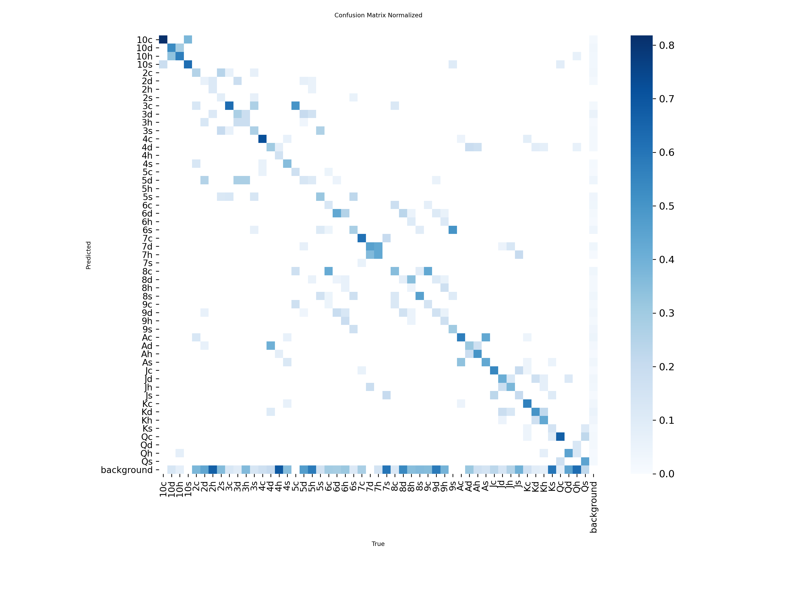
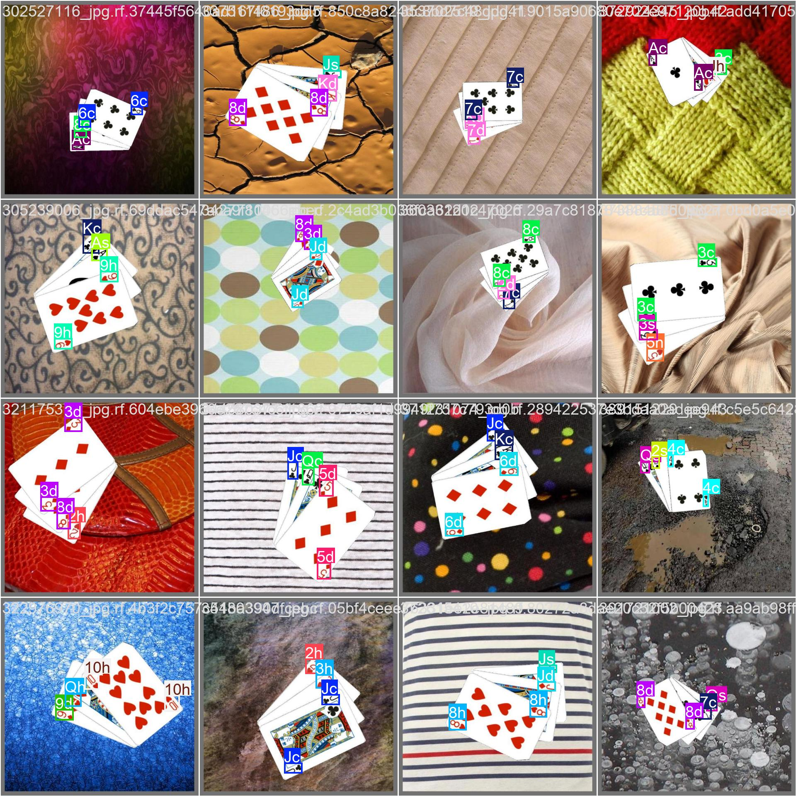

# Hệ thống Nhận diện Lá bài thời gian thực

Dự án này sử dụng mô hình YOLOv8 để nhận diện các lá bài trong video trực tiếp từ webcam.

## Demo Ứng dụng

Dưới đây là hình ảnh minh họa kết quả nhận diện của ứng dụng trong thực tế. Hệ thống có khả năng xác định nhiều lá bài khác nhau trong một khung hình.


## Bộ Dữ liệu (Dataset)

Dự án sử dụng bộ dữ liệu **Playing Cards** được cung cấp bởi Augmented Startups trên nền tảng Roboflow. Đây là bộ dữ liệu chất lượng cao được thiết kế chuyên biệt cho các bài toán nhận diện đối tượng.

- **Link dữ liệu:** [Playing Cards - Roboflow Universe](https://universe.roboflow.com/augmented-startups/playing-cards-ow27d)
- **Chi tiết:** Bộ dữ liệu bao gồm hình ảnh của 10100 lá bài tây  cùng với Joker, được thu thập dưới nhiều điều kiện ánh sáng và góc độ khác nhau.
- **Cấu trúc:** Dữ liệu đã được gán nhãn và chia thành các tập huấn luyện (train), kiểm thử (test) và xác thực (validation), sẵn sàng cho việc huấn luyện các mô hình học sâu.

## Cơ sở Lý thuyết và Ứng dụng trong Mô hình YOLOv8

Trong khi dự án sử dụng trực tiếp mô hình YOLOv8 đã được huấn luyện để thực hiện nhận diện, sức mạnh, tốc độ và sự hiệu quả của mô hình này không phải là ngẫu nhiên. Chúng bắt nguồn từ các nguyên lý tối ưu hóa toán học sâu sắc. Phần này sẽ đi sâu vào cơ sở lý thuyết đó, giải thích cách **Thuật toán Subgradient** được ứng dụng để giải quyết các bài toán như **Lasso** và **Phân cụm lồi**, qua đó tạo ra các mô hình học sâu nhỏ gọn và hiệu suất cao như YOLOv8.

### 1. Nền tảng: Thuật toán Subgradient

Thuật toán Subgradient là công cụ nền tảng để giải quyết các bài toán tối ưu hóa lồi khi hàm mục tiêu không khả vi tại một số điểm. Đây là tình huống cực kỳ phổ biến trong học máy hiện đại, đặc biệt là khi sử dụng các hàm chính quy hóa (regularization) như L1-norm.

Phương pháp lặp của thuật toán có dạng: `x_{k+1} = x_k - α_k * g_k`, nơi `g_k` là một subgradient của hàm mục tiêu. Ý tưởng này cho phép chúng ta tìm điểm tối ưu ngay cả khi không có đạo hàm rõ ràng.

### 2. Biến thể: Thuật toán Subgradient Ngẫu nhiên

Trong thực tế huấn luyện các mô hình học sâu với lượng dữ liệu lớn, việc tính toán subgradient trên toàn bộ tập dữ liệu là rất tốn kém. **Thuật toán Subgradient Ngẫu nhiên** (Randomized Subgradient) được sử dụng để giải quyết vấn đề này.

- **Cơ chế:** Tại mỗi bước lặp, thuật toán chọn ngẫu nhiên một mẫu dữ liệu (hoặc một mini-batch) để tính toán một ước lượng không chệch của subgradient.
- **Công thức:** `x_{k+1} = x_k - α_k * g̃_k`, với `g̃_k` là subgradient ngẫu nhiên.
- **Ứng dụng:** Đây chính là cơ sở của **Stochastic Gradient Descent (SGD)**, phương pháp tối ưu hóa cốt lõi giúp huấn luyện YOLOv8 hiệu quả trên bộ dữ liệu lớn như Playing Cards.

### 3. Bài toán Lasso, Tối ưu hóa YOLOv8 và Thuật toán Subgradient

**Liên kết trực tiếp đến dự án:** Tốc độ real-time của ứng dụng này phụ thuộc hoàn toàn vào sự nhỏ gọn và hiệu quả của mô hình `yolov8n.pt`. Một trong những kỹ thuật quan trọng để tạo ra các mô hình như vậy là **"model pruning"** (tỉa mô hình), và nguyên lý đằng sau nó chính là **Lasso (L1 Regularization)**.

- **Bài toán:** Làm thế nào để giảm kích thước của một mạng neural network (như YOLOv8) mà không làm giảm đáng kể độ chính xác?
- **Giải pháp với Lasso:** Trong quá trình huấn luyện hoặc tinh chỉnh (fine-tuning) mô hình, một thành phần chính quy hóa L1 (`λ * ||w||₁`) được thêm vào hàm mất mát. `w` ở đây là các trọng số của mạng. Thành phần này "phạt" các trọng số có giá trị lớn, và quan trọng hơn, nó **ép buộc các trọng số không quan trọng phải bằng 0**.
- **Kết quả:** Quá trình này tạo ra một mô hình "thưa" (sparse), nơi nhiều kết nối thần kinh đã bị loại bỏ (trọng số bằng 0). Các kênh (channels) hoặc thậm chí toàn bộ các lớp (layers) có thể được xác định là không cần thiết và bị "tỉa" đi, tạo ra một mô hình nhỏ hơn, nhanh hơn, lý tưởng cho các ứng dụng thời gian thực như dự án này.
- **Vai trò của Subgradient:** Vì hàm chính quy hóa L1 không khả vi tại 0, bài toán tối ưu hóa này không thể được giải bằng Gradient Descent thông thường. Thay vào đó, các thuật toán thuộc họ Subgradient (ví dụ: Proximal Gradient Descent, FISTA) được sử dụng để tìm ra lời giải thưa một cách hiệu quả.

**Kết luận:** Như vậy, có một mối liên hệ trực tiếp: **Thuật toán Subgradient** cho phép giải bài toán **Lasso**, và nguyên lý của Lasso được áp dụng trong các kỹ thuật **tỉa mô hình** để tạo ra các phiên bản YOLOv8 hiệu quả (`yolov8n.pt`) mà dự án này đang sử dụng.

### 4. Phân cụm lồi và Phân tích Dữ liệu trong Học máy

**Liên kết trực tiếp đến dự án:** Trước khi huấn luyện một mô hình nhận diện mạnh mẽ, việc hiểu rõ cấu trúc của bộ dữ liệu là cực kỳ quan trọng. Đây là giai đoạn "Phân tích Dữ liệu Khám phá" (Exploratory Data Analysis), và Phân cụm lồi là một công cụ mạnh mẽ cho việc này.

- **Bài toán:** Trong bộ dữ liệu hình ảnh các lá bài, có những nhóm lá bài nào tự nhiên giống nhau về mặt hình ảnh (ví dụ: các lá 'K', 'Q', 'J' có thể có các đặc trưng khuôn mặt tương đồng, hoặc các lá bài cùng một nước (cơ, rô, chuồn, bích) có thể có cấu trúc tương tự)? Việc xác định các nhóm này giúp dự đoán những trường hợp nào mô hình sẽ dễ bị nhầm lẫn.
- **Giải pháp với Phân cụm lồi:**
    1. Trích xuất vector đặc trưng (feature vectors) từ mỗi hình ảnh trong bộ dữ liệu huấn luyện bằng một mạng CNN.
    2. Áp dụng thuật toán Phân cụm lồi lên không gian các vector đặc trưng này.
    - **Kết quả:** Thuật toán sẽ tự động nhóm các hình ảnh vào các cụm lồi, cho thấy các "họ hình ảnh" (visual families) tồn tại trong dữ liệu. Ví dụ, kết quả có thể cho thấy tất cả các lá bài số '7' được nhóm lại gần nhau, nhưng lá '7 cơ' lại nằm ở rìa của cụm đó, gần với cụm của các lá bài '8 cơ' hơn, cho thấy một sự tương đồng về hình ảnh.
- **Vai trò của Subgradient:** Hàm mục tiêu của Phân cụm lồi chứa các thành phần không khả vi, do đó một lần nữa, Thuật toán Subgradient lại là phương pháp cần thiết để tìm ra các cụm một cách tối ưu.

**Kết luận:** Mặc dù không chạy trong script `predict_webcam.py` cuối cùng, Phân cụm lồi là một bước quan trọng trong **quy trình nghiên cứu và phát triển** một hệ thống thị giác máy tính. Nó cung cấp những hiểu biết sâu sắc về dữ liệu, giúp định hướng các chiến lược tăng cường dữ liệu (data augmentation) và thiết kế kiến trúc mô hình.

## Kết quả Thực nghiệm
Dưới đây là một số kết quả từ quá trình huấn luyện mô hình, cho thấy hiệu suất của mô hình nhận diện.

### 1. Ma trận nhầm lẫn (Confusion Matrix)
Ma trận nhầm lẫn (Confusion Matrix) giúp trực quan hóa hiệu suất của mô hình trên từng lớp đối tượng cụ thể. Trục tung thể hiện nhãn thực tế (True Label) và trục hoành thể hiện nhãn dự đoán (Predicted Label). Các ô màu đậm trên đường chéo chính biểu thị số lượng dự đoán chính xác cao cho từng lá bài. Sự nhầm lẫn giữa các lá bài (nếu có) sẽ hiển thị ở các ô ngoài đường chéo, giúp nhận diện các cặp lá bài dễ bị mô hình đoán sai.



### 2. Đường cong PR (Precision-Recall Curve)
Đường cong Precision-Recall (PR Curve) đánh giá sự đánh đổi giữa độ chính xác (Precision) và độ nhạy (Recall) của mô hình tại các ngưỡng confidence khác nhau. Diện tích dưới đường cong (mAP) càng lớn (đường cong tiến về góc trên bên phải) chứng tỏ mô hình có khả năng phát hiện đúng đối tượng cao mà không bị báo động giả (False Positives) hay bỏ sót đối tượng (False Negatives).


### 3. Kết quả nhận diện trên tập huấn luyện
Hình ảnh dưới đây minh họa kết quả nhận diện của mô hình trên một lô (batch) dữ liệu huấn luyện. Các hộp bao và nhãn cho thấy mô hình đã học cách xác định vị trí và loại của các lá bài.



### 4. Thống kê Dữ liệu (Labels)
Biểu đồ `labels.jpg` hiển thị các thống kê quan trọng về bộ dữ liệu đã được gán nhãn:
- **Phân bố lớp (Classes):** Số lượng mẫu (instances) cho mỗi loại lá bài, giúp nhận diện sự mất cân bằng giữa các lớp.
- **Hộp bao (Bounding Boxes):** Phân bố về vị trí trung tâm (x, y) và kích thước (chiều rộng, chiều cao) của các lá bài trong ảnh, giúp hiểu rõ hơn về đặc điểm không gian của dữ liệu huấn luyện.


## Yêu cầu
- Python 3.8 trở lên
- Pip (trình quản lý gói cho Python)
- Webcam

## Hướng dẫn Cài đặt

1.  **Sao chép Repository**
    ```bash
    git clone <https://github.com/VuNam002/PlayingCards_Camera>
    cd PlayingCards_Camera
    ```

2.  **Tạo và Kích hoạt Môi trường ảo**

    Việc sử dụng môi trường ảo là một thông lệ tốt để quản lý các gói phụ thuộc của dự án.

    - Trên Windows:
      ```bash
      python -m venv venv
      .\venv\Scripts\activate
      ```
    - Trên macOS và Linux:
      ```bash
      python3 -m venv venv
      source venv/bin/activate
      ```

3.  **Cài đặt các Gói phụ thuộc**

    Cài đặt tất cả các thư viện cần thiết được liệt kê trong file `requirements.txt`.
    ```bash
    pip install -r requirements.txt
    ```
    *Lưu ý: Quá trình cài đặt `torch` có thể mất một chút thời gian.*

## Cấu hình

1.  **Model Nhận diện (`best.pt`)**
    - Script `predict_webcam.py` yêu cầu file model đã được huấn luyện có tên là `best.pt`.
    - Theo mặc định, script sẽ tìm model tại đường dẫn: `weights/runs/detect/train7/weights/best.pt`.
    - Hãy chắc chắn rằng bạn đã có file model này từ quá trình huấn luyện hoặc đã tải về và đặt nó vào đúng thư mục.
    - Nếu model của bạn nằm ở một vị trí khác, hãy cập nhật biến `model_path` trong file `predict_webcam.py`:
      ```python
      # CẤU HÌNH: Đường dẫn đến file model best.pt
      model_path = r'duong/dan/den/model/cua/ban/best.pt'
      ```

## Chạy Ứng dụng

Sau khi hoàn tất cài đặt và cấu hình, bạn có thể chạy ứng dụng bằng lệnh sau:

```bash
python predict_webcam.py
```

- Một cửa sổ hiển thị hình ảnh từ webcam sẽ xuất hiện ở chế độ toàn màn hình.
- Các lá bài được nhận diện sẽ được đánh dấu bằng các hộp chữ nhật và nhãn.
- Để thoát khỏi ứng dụng, hãy nhấn phím `q`.
