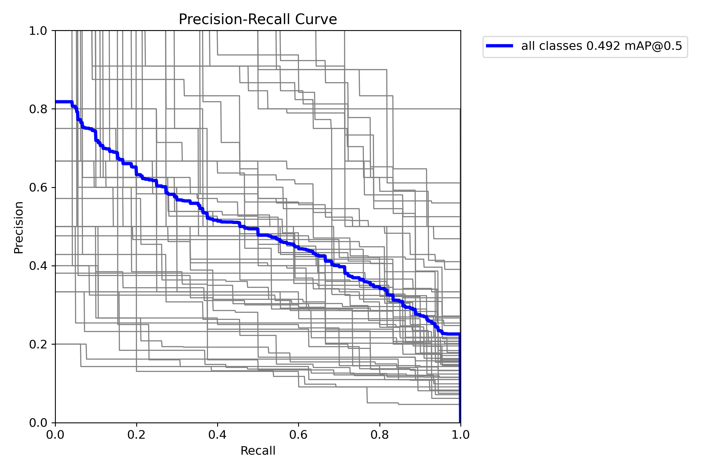

# Hệ thống Nhận diện Lá bài thời gian thực

Dự án này sử dụng mô hình YOLOv8 để nhận diện các lá bài trong video trực tiếp từ webcam.

## Demo Ứng dụng

Dưới đây là hình ảnh minh họa kết quả nhận diện của ứng dụng trong thực tế. Hệ thống có khả năng xác định nhiều lá bài khác nhau trong một khung hình.


## Mô tả Chi tiết Ứng dụng của Thuật toán Subgradient

Dự án này không chỉ là một hệ thống thị giác máy tính thông thường mà còn là một bài toán minh họa sâu sắc cho việc ứng dụng các thuật toán tối ưu hóa lồi, cụ thể là **Thuật toán Subgradient**, vào giải quyết các vấn đề học máy kinh điển. Nền tảng toán học này giúp xây dựng các mô hình mạnh mẽ, hiệu quả và có khả năng khái quát hóa tốt.

### 1. Tổng quan về Thuật toán Subgradient

Thuật toán Subgradient là một phương pháp lặp (iterative method) dùng để giải các bài toán tối ưu hóa cho hàm mục tiêu lồi nhưng **không khả vi** (non-differentiable) tại một số điểm. Trong khi phương pháp Gradient Descent kinh điển yêu cầu hàm mục tiêu phải có đạo hàm tại mọi điểm, Subgradient đã mở rộng ý tưởng này bằng cách sử dụng "subgradient" – một khái niệm tổng quát hóa của gradient.

Tại một điểm, subgradient của một hàm lồi là một vector mà nếu ta vẽ một siêu phẳng đi qua điểm đó với pháp tuyến là vector này, thì toàn bộ đồ thị của hàm sẽ nằm phía trên siêu phẳng đó. Một hàm có thể có nhiều subgradient tại một điểm không khả vi.

Phương pháp lặp của thuật toán Subgradient có dạng:
`x_{k+1} = x_k - α_k * g_k`
Trong đó:
- `x_k`: Lời giải ở bước lặp thứ `k`.
- `α_k`: Kích thước bước (step size) ở bước lặp `k`.
- `g_k`: Một vector subgradient bất kỳ của hàm mục tiêu tại `x_k`.

### 2. Ứng dụng vào Bài toán Lasso (L1 Regularization)

Bài toán Lasso (Least Absolute Shrinkage and Selection Operator) là một kỹ thuật hồi quy (regression) và lựa chọn đặc trưng (feature selection) quan trọng. Hàm mục tiêu của Lasso có dạng:

`f(x) = ||Ax - b||₂² + λ * ||x||₁`

- `||Ax - b||₂²`: Term sai số bình phương (sum of squared errors), đo lường mức độ phù hợp của mô hình với dữ liệu.
- `||x||₁`: Term chính quy hóa L1 (L1-norm), là tổng các giá trị tuyệt đối của các thành phần trong vector `x`.
- `λ`: Tham số điều chỉnh, cân bằng giữa việc tối thiểu sai số và tối thiểu độ lớn của các hệ số trong `x`.

**Vấn đề:** Term `||x||₁` không khả vi tại các điểm mà `x_i = 0`. Do đó, không thể áp dụng Gradient Descent trực tiếp.

**Giải pháp với Subgradient:**
Subgradient của hàm mục tiêu `f(x)` được tính bằng cách cộng subgradient của hai thành phần:
`∂f(x) = 2 * Aᵀ(Ax - b) + λ * ∂||x||₁`

Trong đó, `∂||x||₁` là tập hợp các subgradient của L1-norm. Một subgradient `g` của `||x||₁` có thành phần thứ `i` là:
- `g_i = sgn(x_i)` nếu `x_i ≠ 0`
- `g_i ∈ [-1, 1]` nếu `x_i = 0`

Bằng cách lặp đi lặp lại bước cập nhật Subgradient, thuật toán sẽ hội tụ về một vector `x` tối ưu. Đặc tính quan trọng của Lasso là nó tạo ra các lời giải **thưa (sparse)**, nghĩa là nhiều thành phần của `x` sẽ bằng 0. Trong ngữ cảnh của dự án, `x` có thể được coi là vector trọng số của các đặc trưng (features) ảnh. Việc làm cho `x` trở nên thưa giúp mô hình **tự động loại bỏ các đặc trưng không quan trọng**, giảm độ phức tạp, chống lại hiện tượng học vẹt (overfitting) và tăng tốc độ xử lý.

### 3. Ứng dụng vào Bài toán Phân cụm lồi (Convex Clustering)

Phân cụm lồi là một phương pháp hiện đại để nhóm các điểm dữ liệu bằng cách giải một bài toán tối ưu hóa lồi. Thay vì dựa trên các heuristic như K-Means, nó đảm bảo tìm ra lời giải tối ưu toàn cục.

Hàm mục tiêu của phân cụm lồi thường có dạng:
`f(U) = (1/2) * ||U - X||_F² + λ * Σ_{i<j} w_{ij} * ||u_i - u_j||₂`

- `X`: Ma trận dữ liệu đầu vào.
- `U`: Ma trận chứa các tâm cụm (centroids) cần tìm, mỗi cột `u_i` là một tâm cụm.
- `||U - X||_F²`: Term sai số, yêu cầu các tâm cụm `U` phải gần với dữ liệu gốc `X`.
- `λ * Σ w_{ij} * ||u_i - u_j||₂`: Term chính quy hóa (fusion penalty). Nó "khuyến khích" các cặp tâm cụm `u_i` và `u_j` tiến lại gần nhau và hợp nhất.

**Vấn đề:** Term chính quy hóa này cũng không khả vi khi `u_i = u_j`.

**Giải pháp với Subgradient:**
Tương tự như Lasso, ta có thể áp dụng thuật toán Subgradient để tối thiểu hàm mục tiêu `f(U)`. Thuật toán sẽ cập nhật ma trận tâm cụm `U` theo hướng ngược lại của một subgradient, buộc các tâm cụm của các điểm dữ liệu gần nhau phải hợp nhất.

Trong dự án này, thuật toán Phân cụm lồi có thể được ứng dụng trong một giai đoạn tiền xử lý hoặc phân tích đặc trưng. Ví dụ, ta có thể trích xuất các đặc trưng sâu (deep features) từ các hình ảnh lá bài và sử dụng phân cụm lồi để **tự động nhóm các lá bài có đặc điểm hình ảnh tương tự nhau** (ví dụ: nhóm các lá bài Át, nhóm các lá bài số 10). Việc này giúp tạo ra một cấu trúc dữ liệu có tổ chức, từ đó hỗ trợ cho quá trình huấn luyện mô hình nhận diện chính xác và hiệu quả hơn.

## Kết quả Thực nghiệm
Dưới đây là một số kết quả từ quá trình huấn luyện mô hình, cho thấy hiệu suất của mô hình nhận diện.

### 1. Ma trận nhầm lẫn (Confusion Matrix)
Ma trận nhầm lẫn cho thấy độ chính xác của mô hình trên từng lớp (mỗi lá bài). Các giá trị trên đường chéo chính càng cao, mô hình càng chính xác.


### 2. Đường cong PR (Precision-Recall Curve)
Đường cong PR thể hiện sự cân bằng giữa Precision (độ chính xác) và Recall (độ phủ) tại các ngưỡng tin cậy khác nhau. Một đường cong càng gần góc trên bên phải càng cho thấy hiệu suất tốt.



### 3. Kết quả nhận diện trên tập huấn luyện
Hình ảnh dưới đây minh họa kết quả nhận diện của mô hình trên một lô (batch) dữ liệu huấn luyện. Các hộp bao và nhãn cho thấy mô hình đã học cách xác định vị trí và loại của các lá bài.


## Yêu cầu
- Python 3.8 trở lên
- Pip (trình quản lý gói cho Python)
- Webcam

## Hướng dẫn Cài đặt

1.  **Sao chép Repository**
    ```bash
    git clone <https://github.com/VuNam002/PlayingCards_Camera>
    cd PlayingCards_Camera
    ```

2.  **Tạo và Kích hoạt Môi trường ảo**

    Việc sử dụng môi trường ảo là một thông lệ tốt để quản lý các gói phụ thuộc của dự án.

    - Trên Windows:
      ```bash
      python -m venv venv
      .\venv\Scripts\activate
      ```
    - Trên macOS và Linux:
      ```bash
      python3 -m venv venv
      source venv/bin/activate
      ```

3.  **Cài đặt các Gói phụ thuộc**

    Cài đặt tất cả các thư viện cần thiết được liệt kê trong file `requirements.txt`.
    ```bash
    pip install -r requirements.txt
    ```
    *Lưu ý: Quá trình cài đặt `torch` có thể mất một chút thời gian.*

## Cấu hình

1.  **Model Nhận diện (`best.pt`)**
    - Script `predict_webcam.py` yêu cầu file model đã được huấn luyện có tên là `best.pt`.
    - Theo mặc định, script sẽ tìm model tại đường dẫn: `weights/runs/detect/train7/weights/best.pt`.
    - Hãy chắc chắn rằng bạn đã có file model này từ quá trình huấn luyện hoặc đã tải về và đặt nó vào đúng thư mục.
    - Nếu model của bạn nằm ở một vị trí khác, hãy cập nhật biến `model_path` trong file `predict_webcam.py`:
      ```python
      # CẤU HÌNH: Đường dẫn đến file model best.pt
      model_path = r'duong/dan/den/model/cua/ban/best.pt'
      ```

## Chạy Ứng dụng

Sau khi hoàn tất cài đặt và cấu hình, bạn có thể chạy ứng dụng bằng lệnh sau:

```bash
python predict_webcam.py
```

- Một cửa sổ hiển thị hình ảnh từ webcam sẽ xuất hiện ở chế độ toàn màn hình.
- Các lá bài được nhận diện sẽ được đánh dấu bằng các hộp chữ nhật và nhãn.
- Để thoát khỏi ứng dụng, hãy nhấn phím `q`.